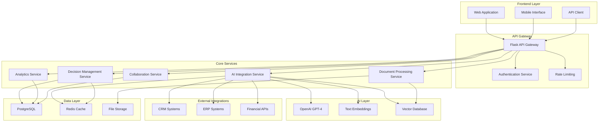
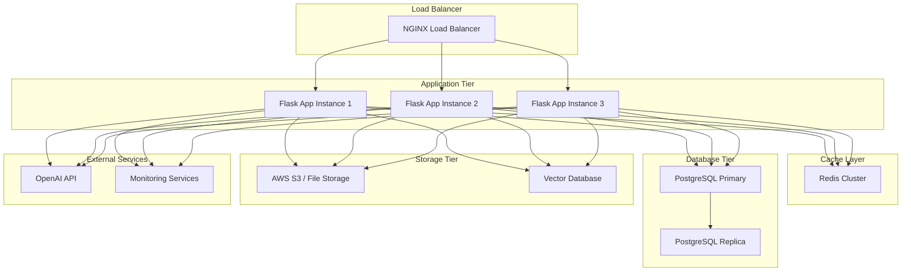

# AI Executive Suite Enhancement Design Document

## Overview

This design document outlines the architecture and implementation approach for enhancing the existing AI Executive Suite with advanced AI integration, analytics, collaboration features, and enterprise capabilities. The design maintains backward compatibility while adding sophisticated new features that transform the system from a demo application into a production-ready business intelligence platform.

## Architecture

### High-Level Architecture



### Service Architecture

The system follows a microservices-inspired architecture within a Flask application, with clear separation of concerns:

1. **API Gateway Layer**: Handles routing, authentication, rate limiting, and request validation
2. **Core Services Layer**: Business logic services for different functional areas
3. **AI Integration Layer**: Manages LLM interactions, embeddings, and vector search
4. **Data Layer**: Persistent storage and caching
5. **Integration Layer**: External system connections

## Components and Interfaces

### 1. AI Integration Service

**Purpose**: Manages all AI model interactions and provides intelligent responses

**Key Components**:
- **LLM Manager**: Handles OpenAI API calls with retry logic and error handling
- **Prompt Engine**: Manages role-specific prompts and context injection
- **Context Manager**: Maintains conversation history and document context
- **Response Processor**: Formats and validates AI responses

**Interface**:
```python
class AIIntegrationService:
    def generate_executive_response(
        self, 
        executive_type: str, 
        context: str, 
        conversation_history: List[Dict],
        document_context: List[str] = None,
        options: List[str] = None
    ) -> ExecutiveResponse
    
    def get_document_insights(
        self, 
        document_id: str, 
        query: str
    ) -> DocumentInsights
    
    def analyze_decision_patterns(
        self, 
        decisions: List[Decision]
    ) -> PatternAnalysis
```

### 2. Decision Management Service

**Purpose**: Handles decision lifecycle, storage, and status tracking

**Key Components**:
- **Decision Repository**: Database operations for decisions
- **Status Manager**: Tracks decision implementation and outcomes
- **Notification Engine**: Sends updates to stakeholders
- **Audit Logger**: Maintains complete decision audit trails

**Interface**:
```python
class DecisionManagementService:
    def create_decision(
        self, 
        decision_data: DecisionCreateRequest
    ) -> Decision
    
    def update_decision_status(
        self, 
        decision_id: str, 
        status: DecisionStatus,
        notes: str = None
    ) -> Decision
    
    def get_decision_history(
        self, 
        filters: DecisionFilters
    ) -> List[Decision]
    
    def calculate_decision_effectiveness(
        self, 
        decision_id: str
    ) -> EffectivenessMetrics
```

### 3. Document Processing Service

**Purpose**: Handles document upload, processing, and context extraction

**Key Components**:
- **File Processor**: Extracts text from various file formats
- **Content Analyzer**: Identifies key information and metadata
- **Vector Indexer**: Creates embeddings for semantic search
- **Security Scanner**: Validates file safety and content

**Interface**:
```python
class DocumentProcessingService:
    def upload_document(
        self, 
        file: FileUpload, 
        metadata: DocumentMetadata
    ) -> Document
    
    def extract_context(
        self, 
        document_id: str, 
        query: str
    ) -> List[DocumentContext]
    
    def search_documents(
        self, 
        query: str, 
        filters: DocumentFilters
    ) -> List[DocumentSearchResult]
```

### 4. Analytics Service

**Purpose**: Provides business intelligence and decision analytics

**Key Components**:
- **Metrics Calculator**: Computes KPIs and performance metrics
- **Trend Analyzer**: Identifies patterns in decision data
- **Report Generator**: Creates visual reports and dashboards
- **Benchmark Engine**: Compares performance against industry standards

**Interface**:
```python
class AnalyticsService:
    def generate_decision_analytics(
        self, 
        time_range: DateRange,
        filters: AnalyticsFilters
    ) -> DecisionAnalytics
    
    def calculate_financial_metrics(
        self, 
        financial_data: FinancialData
    ) -> FinancialMetrics
    
    def get_performance_dashboard(
        self, 
        user_id: str
    ) -> DashboardData
```

### 5. Collaboration Service

**Purpose**: Manages team collaboration on decisions

**Key Components**:
- **Team Manager**: Handles team membership and permissions
- **Comment System**: Manages decision comments and discussions
- **Notification Hub**: Sends collaboration notifications
- **Workflow Engine**: Manages approval workflows

**Interface**:
```python
class CollaborationService:
    def invite_collaborators(
        self, 
        decision_id: str, 
        user_ids: List[str],
        permissions: CollaborationPermissions
    ) -> CollaborationSession
    
    def add_comment(
        self, 
        decision_id: str, 
        comment: CommentData
    ) -> Comment
    
    def get_collaboration_history(
        self, 
        decision_id: str
    ) -> List[CollaborationEvent]
```

## Data Models

### Enhanced Decision Model

```python
@dataclass
class EnhancedDecision:
    id: str
    user_id: str
    executive_type: str  # 'ceo', 'cto', 'cfo'
    title: str
    context: str
    decision: str
    rationale: str
    confidence_score: float  # 0.0 to 1.0
    priority: str
    category: str
    status: str
    financial_impact: Optional[Decimal]
    risk_level: str
    implementation_notes: Optional[str]
    outcome_rating: Optional[int]  # 1-5 scale
    effectiveness_score: Optional[float]
    
    # Relationships
    collaborators: List[str]
    comments: List[Comment]
    documents: List[str]  # Document IDs
    related_decisions: List[str]
    
    # Metadata
    created_at: datetime
    updated_at: datetime
    implemented_at: Optional[datetime]
    reviewed_at: Optional[datetime]
    
    # AI Context
    conversation_history: List[Dict]
    ai_model_version: str
    prompt_version: str
```

### Document Model

```python
@dataclass
class Document:
    id: str
    user_id: str
    filename: str
    file_type: str
    file_size: int
    content_hash: str
    
    # Content
    extracted_text: str
    summary: str
    key_insights: List[str]
    
    # Classification
    document_type: str  # 'financial', 'technical', 'strategic', 'legal'
    sensitivity_level: str  # 'public', 'internal', 'confidential', 'restricted'
    
    # Vector embeddings for search
    embedding_id: str
    
    # Metadata
    created_at: datetime
    processed_at: Optional[datetime]
    last_accessed: Optional[datetime]
    
    # Usage tracking
    reference_count: int
    decisions_referenced: List[str]
```

### Analytics Models

```python
@dataclass
class DecisionAnalytics:
    total_decisions: int
    decisions_by_executive: Dict[str, int]
    decisions_by_category: Dict[str, int]
    decisions_by_priority: Dict[str, int]
    average_confidence_score: float
    implementation_rate: float
    effectiveness_scores: Dict[str, float]
    
    # Time series data
    decisions_over_time: List[TimeSeriesPoint]
    trends: Dict[str, TrendData]
    
    # Financial metrics
    total_financial_impact: Decimal
    roi_by_category: Dict[str, Decimal]
    cost_savings: Decimal

@dataclass
class FinancialMetrics:
    revenue_metrics: Dict[str, Decimal]
    cost_metrics: Dict[str, Decimal]
    profitability_metrics: Dict[str, Decimal]
    efficiency_ratios: Dict[str, float]
    growth_rates: Dict[str, float]
    benchmark_comparisons: Dict[str, BenchmarkData]
```

## Error Handling

### Error Categories

1. **AI Service Errors**:
   - LLM API failures (rate limits, timeouts, service unavailable)
   - Invalid prompt or context errors
   - Response parsing failures

2. **Data Validation Errors**:
   - Invalid input parameters
   - Missing required fields
   - Data format violations

3. **Integration Errors**:
   - External API failures
   - Authentication errors
   - Data synchronization issues

4. **Security Errors**:
   - Unauthorized access attempts
   - Invalid authentication tokens
   - Permission violations

### Error Handling Strategy

```python
class ErrorHandler:
    def handle_ai_service_error(self, error: AIServiceError) -> ErrorResponse:
        if error.type == "rate_limit":
            return self.create_retry_response(error.retry_after)
        elif error.type == "service_unavailable":
            return self.create_fallback_response()
        else:
            return self.create_error_response(error)
    
    def handle_validation_error(self, error: ValidationError) -> ErrorResponse:
        return ErrorResponse(
            status_code=400,
            message="Invalid input data",
            details=error.validation_errors,
            suggestions=self.get_input_suggestions(error)
        )
```

## Testing Strategy

### Unit Testing
- **Service Layer**: Test each service component in isolation
- **AI Integration**: Mock LLM responses for consistent testing
- **Data Models**: Validate model behavior and constraints
- **Utilities**: Test helper functions and utilities

### Integration Testing
- **API Endpoints**: Test complete request/response cycles
- **Database Operations**: Test data persistence and retrieval
- **External Integrations**: Test with mock external services
- **Authentication Flow**: Test all authentication methods

### End-to-End Testing
- **User Workflows**: Test complete user journeys
- **Decision Lifecycle**: Test from creation to implementation
- **Collaboration Features**: Test multi-user interactions
- **Mobile Interface**: Test responsive design and mobile features

### Performance Testing
- **Load Testing**: Test system under high user load
- **AI Response Times**: Measure and optimize LLM response times
- **Database Performance**: Test query performance with large datasets
- **File Processing**: Test document processing with various file sizes

### Security Testing
- **Authentication**: Test all authentication methods and edge cases
- **Authorization**: Verify proper access controls
- **Data Protection**: Test encryption and data handling
- **Input Validation**: Test against injection attacks and malformed input

## Deployment Architecture

### Production Environment



### Scalability Considerations

1. **Horizontal Scaling**: Multiple Flask application instances behind load balancer
2. **Database Scaling**: Read replicas for analytics queries
3. **Caching Strategy**: Redis for session data, API responses, and frequently accessed data
4. **File Storage**: Cloud storage for documents with CDN for static assets
5. **AI Service Scaling**: Connection pooling and request queuing for LLM APIs

### Security Measures

1. **Network Security**: VPC, security groups, and firewall rules
2. **Data Encryption**: TLS in transit, AES-256 at rest
3. **Access Control**: Role-based permissions and API key management
4. **Monitoring**: Real-time security monitoring and alerting
5. **Backup Strategy**: Automated backups with point-in-time recovery

This design provides a robust foundation for transforming the AI Executive Suite into a production-ready enterprise application while maintaining the existing functionality and user experience.